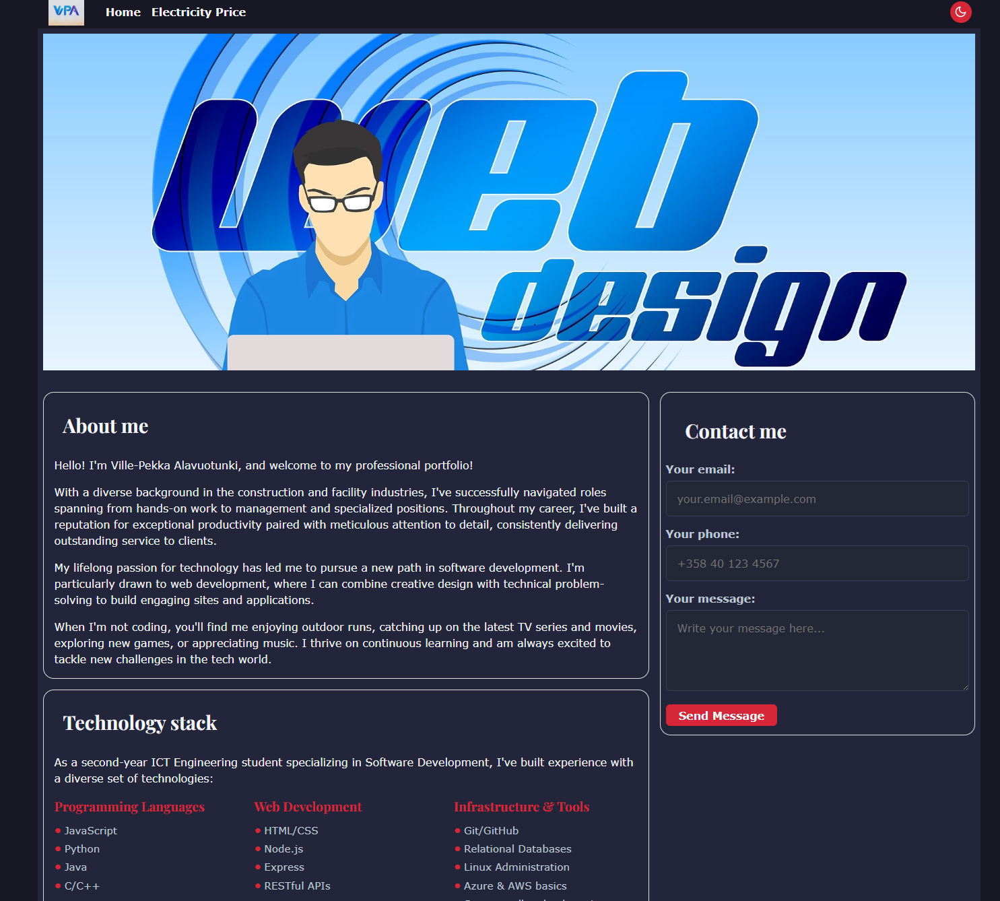
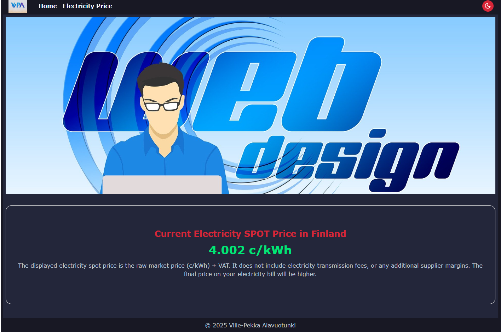

# Web-sovellusten Perusteet -harjoitustyö
Harjoitustyössä tarkoituksena oli luoda Oulun ammattikorkeakoulun Web-sovellusten perusteet-opintojaksolla käytetyillä teknologioilla: HTML, CSS ja Javascript jokin mielekäs sovellus. Aiheen valinta osoittautui tehtävää aloittaessa ehkä haasteellisimmaksi, joten päädyin lopulta tekemään omat kotisivuni, eli ns. portfolio-sivut, jonne lisään toiminnallisuuksia harjoituksen vaatimusten mukaisesti.

## Sivuston yleiset ominaisuudet
Sivuston pääsivulla on hieman esittelyä minusta ja teknologioista, joihin olen tutustunut opintojen / harrastusten kautta. 
Pääsivun oikeassa laidassa on asideen toteutettu yhteydenottolomake, johon käytin apuna formspreen ilmaisversiota. Tällä saa 50 lomakelähetystä per kuukausi, mikä on varmasti riittävästi tämänkaltaiseen sivustoon. 

Sivusto löytyy osoitteesta: https://alavuvi.github.io/web-sovellusten-perusteet-harjoitusty-/

Yleisesti sivusto on suunniteltu responsiiviseksi käyttämällä CSS -tyylimäärityksiä ja media queryitä. Aside siirtyy esim. puhelimella selatessa luonnollisesti artikkelikenttien alle viimeiseksi. 

Sivustolle on toteutettu teemavalitsin JavaScriptillä, joka tallentaa valitun teeman localstorageen. Joten teemavalinta on käytössä myös sivuvaihdon yhteydessä.  

Bannerikuva löytyy osoitteesta: https://pixabay.com/illustrations/web-design-webdesign-web-design-1668927/

## Sähkönhinta -sovellus
Sivustolle tein harjoitusmuodossa sähkönpörssihinnan näyttämiseen oman sivun. Sivustolla näkyy kyseisen tunnin mukainen verollinen sähkönpörssihinta. Tiedot haetaan: https://porssisahko.net/api -osoitteesta ja ohjelmakoodi on toteutettu JavaScriptillä. Sovellus tekee fetch pyynnön rajapintaan ja noudattaa virheidenhallinnassa try-catch -rakennetta. Jos vastausta ei rajapinnasta kuulu, niin tästä ilmoitetaan käyttäjälle. Tästä sovelluksesta saisi huomattavasti käytännöllisemmän lisäämällä backendin. Tämä API on avoin, joten ei ole tarvetta erilliselle API avaimelle.

Tämän kanssa oli aluksi hieman ongelmia, kun tiedonhaku API:sta ei onnistunut ilman proxyä, mutta kun sen lisäsi koodiin niin homma lähti toimimaan.

## Lopputunnelmat
Mielestäni harjoitus oli hyvä ja opettava, kun pääsi hyödyntämään opintojaksolla käytettyjä teknologioita johonkin omaan pieneen projektiin. Vaikka sivustosta ihan asiallisen näköinen tulikin, niin en sitä yleisessä jaossa aio arvosanan saamisen jälkeen pitää.

Kurssin aikana webkehitys kärpänen pääsi kuitenkin sen verran puraisemaan, että päätin aloittaa tämän jatkoksi Helsingin Yliopiston Full Stack Open -kurssin, jossa sukelletaan syvemmälle moderniin webkehitykseen. Tämä kurssi löytyy osoitteesta: https://fullstackopen.com/